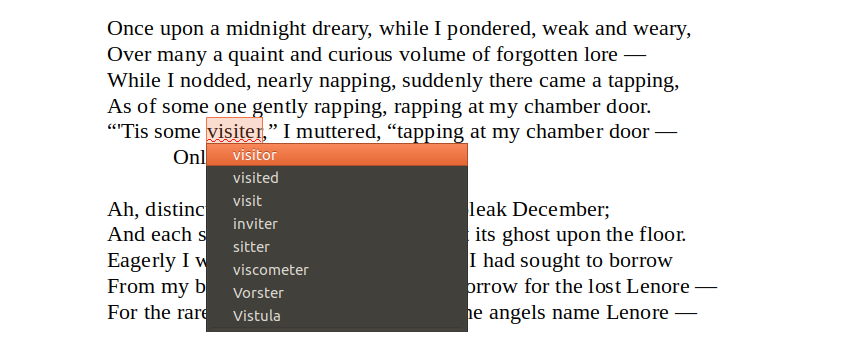

<table>
<tr>
  <td><b>hunspell</b></td>
  <td></td>
  <td></td>
</tr>
<tr>
  <td><b>hyphen</b></td>
  <td></td>
  <td></td>
</tr>
</table>

## Introduction

Hunspell is the free and open source spell checker that is integrated in many mainstream office suites, web browsers, email clients, computer-assisted translation services and other applications working with text. Familiair examples of proprietary or free and open source software using Hunspell are:
* [LibreOffice](https://www.libreoffice.org/)
* Apache [OpenOffice.org](https://www.openoffice.org/)
* Mozilla [Firefox](https://www.mozilla.org/firefox/)
* Google [Chrome](https://www.google.com/chrome/) and [Chromium](https://www.chromium.org/)
* [Opera](https://www.opera.com/)
* [Thunderbird](https://www.thunderbird.net/)
* Apple [macOS](https://www.apple.com/macos/) and [Safari](https://www.apple.com/safari/)
* Adobe [Photoshop](https://www.adobe.com/photoshop/), [Illustator](https://www.adobe.com/illustrator/), [InDesign](https://www.adobe.com/indesign/) and more products

Also lesser-known text editors and more technical software such as integrated development environments (IDEs) also use Hunspell. See [Wikipedia](https://en.wikipedia.org/wiki/Hunspell) for a longer list.

The authors of Hunspell have also created [Hyphen](https://github.com/hunspell/hyphen), a hyphenation solution that was created by the same authors. It is to be used in the same office suites, web browsers et cetera for hyphenating texts.

## Features

Hunspell's main features are:
* extensive support for language peculiarities with [Unicode](https://en.wikipedia.org/wiki/Unicode), [affixing](https://en.wikipedia.org/wiki/Affix), [compounding](https://en.wikipedia.org/wiki/Compound_%28linguistics%29) and complex morphology
* suggestion improvements using [*n*-gram](https://en.wikipedia.org/wiki/N-gram) similarity, rule and dictionary based pronunciation data
* [morphological analysis](https://en.wikipedia.org/wiki/Morphology_%28linguistics%29), [stemming](https://en.wikipedia.org/wiki/Stemming) and [generation](https://en.wikipedia.org/wiki/Generative_grammar)

Furthermore, Hunspell has:
* backwards compatability for dictionaries made for its predecessor [MySpell](https://en.wikipedia.org/wiki/MySpell)
* a C++ library under GPL/LGPL/MPL tri-license
* interfaces and ports:
    * [AndroidHunspellService](https://github.com/mweimerskirch/AndroidHunspellService) (for Android, based on the Chromium fork of Hunspell)
    * [Enchant](http://www.abisource.com/enchant/) (Generic spelling library from the Abiword project)
    * [XSpell](http://sourceforge.net/projects/openxspell/) (macOS port, but Hunspell is part of the macOS from version 10.6 (Snow Leopard), and now it is enough to place the Hunspell dictionary files into ~/Library/Spelling or /Library/Spelling for spell checking)
    * [Delphi](http://downloads.sourceforge.net/hunspell/delphi.zip)
    * Java ([JNA](http://dion.swamp.dk/hunspell.html), [JNI](http://tkltrans.sourceforge.net/magyar/huncheck.tar.gz) and [Lucene](https://www.programcreek.com/java-api-examples/index.php?api=org.apache.lucene.analysis.hunspell.Dictionary))
    * [Perl](http://search.cpan.org/~eleonora/text_hunspell_1.2/Hunspell.pm)
    * [.NET](http://nhunspell.sourceforge.net/)
    * [.NET Standard](https://github.com/aarondandy/WeCantSpell.Hunspell)
    * [Python](https://pypi.python.org/pypi/org.keyphrene)
    * Ruby ([1](http://rubyforge.org/projects/ruby-hunspell/), [2](http://rubyforge.org/projects/hunspell), [3](http://rubygems.org/gems/hunspell-ffi))
    * [UNO](http://downloads.sourceforge.net/hunspell/hunspell_UNO_1.2.tar.gz)
    * [RichEdit](http://sourceforge.net/projects/hunspell/files/Misc/RichEdit/).

## Languages and Users

Currently, almost 90 different languages and language variations are supported. This covers the languages used in almost 200 countries or geographic regions in the world. As many users can also use a second language, such as English, the Hunspell spell check is used by almost all of the approximately 2.5 billion computer users. That is a user base of a third of the Earth's population.

Language support is found in dictionaries for:
* [LibreOffice](https://wiki.documentfoundation.org/Language_support_of_LibreOffice), [development files](http://cgit.freedesktop.org/libreoffice/dictionaries/tree/)
* [LibreOffice extensions](http://extensions.libreoffice.org/extensions?getCategories=Dictionary&getCompatibility=any&sort_on=positive_ratings&path=%2FLibreOffice-Extensions-and-Templates%2Fextension-center&portal_type=PSCProject&SearchableText=)
* Mozilla [Firefox Add-ons](https://addons.mozilla.org/firefox/language-tools/)
* [Thunderbird Add-ons](https://addons.mozilla.org/thunderbird/language-tools/)
* [Ubuntu](https://packages.ubuntu.com/search?keywords=hunspell-&searchon=names)

## Contributing

Spell checking can be very complex material, but that should be a reason not to contribute to this project. Hunspell isn't simply using a list of correct words, but a mechanism of very intricate spell checking techniques and tactics. Nevertheless, we can use help on all levels from fixing bugs, implementie feature request, improving support for a certain language or packaging language support for operating systems, browsers or office suites. Contact us if you can contribute with your skills.

## Sponsoring

Several organisation have enabled the development and maintenance of Hunspell. The sponsors, past and current, are:
* Sponsors of project "[Dutchspell in Hunspell](http://sf.own-it.nl/wiki/opentaal/Wijzigingen_in_Hunspell_die_voor_ons_worden_gemaakt)" by [OpenTaal Foundation](https://www.opentaal.org/opentaal/english) and [Dutch Language Union](http://taalunieversum.org/en/)
* Primary project sponsor: [FSF.hu Foundation](http://www.fsf.hu/)
* Primary sponsor in 2008: [IMEDIA Media Monitoring](http://www.imedia.hu/)
* Primary sponsor of the Hunspell development in 2003–2005: [Budapest Technical University Media Research Centre (BME MOKK)](http://mokk.bme.hu/)
* [Mozilla Open Source Support](https://www.mozilla.org/moss/) in [2017 and 2018](https://blog.mozilla.org/blog/2017/04/10/mozilla-awards-365000-to-open-source-projects-as-part-of-moss/) for the rewrite in pure C++ called [Nuspell](https://github.com/hunspell/nuspell), version 2.0

Contact us if you are considering sponsoring the developement and maintenance of free and open source spell checking. Especially with so many users and many different software integrations, this software is in constant need of proficient support. Reducing spelling errors not only improves quality of communication and indirectly teaches people about spelling, but it also reduces the risk for costly errors that could have been prevented.

## Contact

The code, wiki and issues are managed at [GitHub](https://github.com/hunspell/hunspell). Use that repository, also the closed issues, for any questions or contributions. The original author is László Németh (email: nemeth at [numbertext dot org](http://www.numbertext.org/)), [FSF.hu Foundation](http://www.fsf.hu/about-us), Hungary. Find Hunspell also on social media such as [Facebook](https://www.facebook.com/hunspell/) and on [Twitter](https://twitter.com/hashtag/hunspell).
